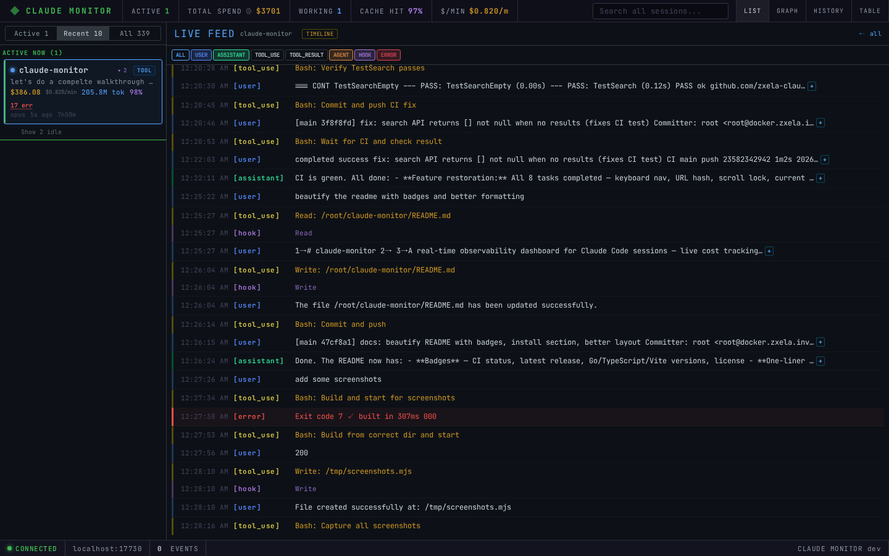
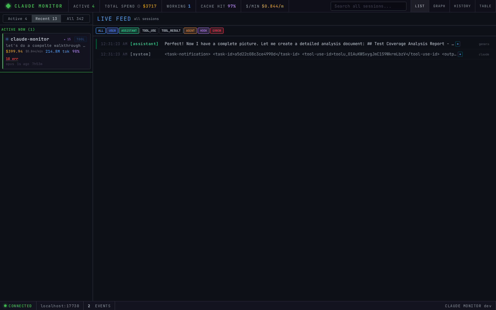
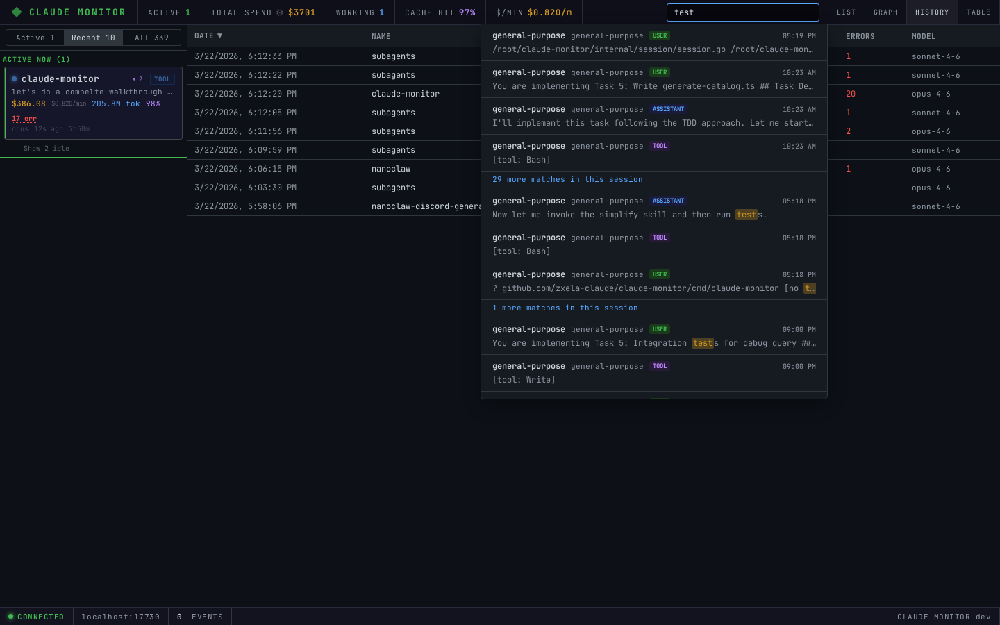
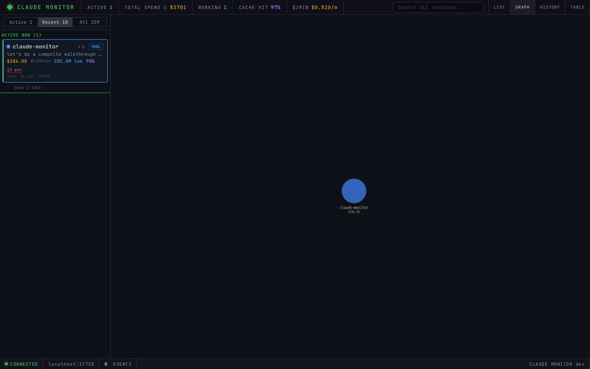
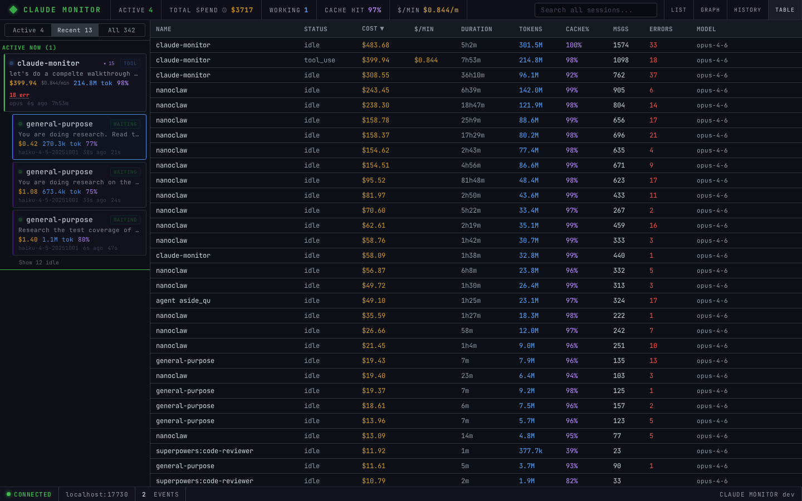
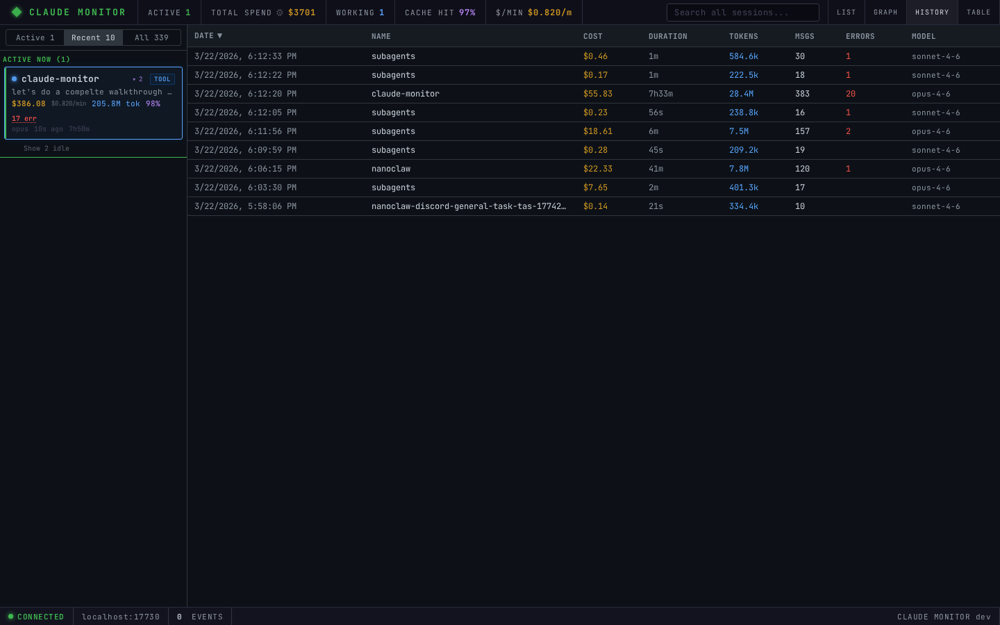

<p align="center">
  
  
  
  <a href="https://github.com/Zxela/claude-monitor/actions/workflows/ci.yml"></a>
  <a href="https://github.com/Zxela/claude-monitor/releases/latest"></a>
  
</p>

<h1 align="center">claude-monitor</h1>

<p align="center">
  Real-time observability dashboard for <a href="https://claude.com/claude-code">Claude Code</a> sessions.<br/>
  Live cost tracking, agent hierarchy, tool execution feeds, session replay, and more.
</p>

---

<p align="center">
  
</p>

## Install

```bash
curl -fsSL https://raw.githubusercontent.com/Zxela/claude-monitor/main/install.sh | sh
```

Or build from source:

```bash
git clone https://github.com/Zxela/claude-monitor.git
cd claude-monitor
make build
```

## Usage

```bash
# Start (watches ~/.claude, auto-discovers Docker containers)
claude-monitor

# Open dashboard
open http://localhost:7700

# Custom port + additional watch paths
claude-monitor --port 8080 --watch /path/to/.claude/projects

# Enable Swagger UI
claude-monitor --swagger
# Then visit http://localhost:7700/swagger
```

## Features

### Session Monitoring

- **Live session tracking** via fsnotify + polling of `.claude/projects/` JSONL files
- **Model-specific pricing** for Opus ($15/$75), Sonnet ($3/$15), Haiku ($0.80/$4)
- **Real-time status** tracking: thinking, tool_use, waiting, idle
- **Docker auto-discovery** of `.claude` mounts in running containers
- **Budget alerts** with configurable threshold and browser notifications

### Dashboard

<table>
<tr><td width="50%">

**Session Panel**
- Time-grouped sessions: Active Now, Last Hour, Today, Yesterday, This Week, Older
- Active/Recent/All filter tabs with counts
- Collapsible subagent hierarchy with idle toggle
- Current tool display on active cards
- Click error count to filter feed to errors

</td><td width="50%">

**Live Feed**
- Color-coded event stream (user, assistant, tool, result, hook, error)
- Type filter toggles with shift+click solo mode
- Tool call + result visual grouping
- Expandable content with code-block styling
- Multi-session mode by default, single-session on click

</td></tr>
</table>

<details>
<summary><strong>Dashboard Overview</strong> — click to expand</summary>

</details>

<details>
<summary><strong>Search</strong> — click to expand</summary>

</details>

### Views

| View | Shortcut | Description |
|------|----------|-------------|
| **List** | default | Session cards + live feed |
| **Graph** | `g` | Force-directed agent dependency graph (Canvas 2D) |
| **Table** | `t` | Dense sortable comparison table of all sessions |
| **History** | `h` | SQLite-backed table of completed sessions |
| **Timeline** | click | Horizontal waterfall of events with zoom/pan |
| **Replay** | click | Session replay with scrubber, speed control, SSE stream |

<details>
<summary><strong>Graph View</strong> — click to expand</summary>

</details>

<details>
<summary><strong>Table View</strong> — click to expand</summary>

</details>

<details>
<summary><strong>History View</strong> — click to expand</summary>

</details>

### Keyboard Shortcuts

| Key | Action |
|-----|--------|
| `/` | Focus search |
| `Esc` | Clear search / deselect / close |
| `↑` `↓` | Navigate sessions |
| `Enter` | Select focused session |
| `←` `→` | Collapse / expand subagents |
| `1` `2` `3` | Active / Recent / All filter |
| `g` `h` `t` | Graph / History / Table view |
| `?` | Help overlay |
| `Space` | Replay: play / pause |
| `R` | Replay: restart |

### Analytics

- **Per-session**: cost, tokens, cache hit %, messages, errors, cost rate ($/min), duration
- **Global stats**: active count, total spend, working agents, weighted cache %, aggregate $/min
- **Cross-session search** with highlighted results grouped by session
- **Session history** persisted to SQLite for historical analysis

## Docker

```bash
docker build -t claude-monitor .

docker run \
  -v ~/.claude:/home/node/.claude:ro \
  -v /var/run/docker.sock:/var/run/docker.sock:ro \
  -p 127.0.0.1:7700:7700 \
  claude-monitor
```

> **Security:** Always bind to `127.0.0.1`. The dashboard exposes all session content including tool inputs/outputs.

## Architecture

```
JSONL files ─────────┐
  (fsnotify + poll)  │
                     ├──> Parser ──> Session Store ──> WebSocket Hub ──> Browser
Docker containers ───┘                    │
  (auto-discovery)                        │
                                     REST API ──> SQLite History
```

### Tech Stack

| Component | Technology |
|-----------|-----------|
| Backend | Go 1.25, stdlib `net/http`, gorilla/websocket |
| Frontend | TypeScript 5.7, Vite 6, vanilla DOM (no framework) |
| Database | modernc.org/sqlite (pure Go, WAL mode) |
| File watching | fsnotify + 5s polling fallback |
| Graphs | Canvas 2D (no D3) |
| Build | Makefile (`make build`, `make dev`, `make test`) |

## API

Full OpenAPI spec at [`api/openapi.yaml`](api/openapi.yaml). Enable Swagger UI with `--swagger`.

| Endpoint | Description |
|----------|-------------|
| `GET /health` | Health check |
| `GET /api/version` | Server version |
| `GET /api/sessions` | All sessions with aggregated stats |
| `GET /api/sessions/grouped` | Sessions grouped by time bucket |
| `GET /api/projects` | Distinct project names with counts |
| `GET /api/search?q=&limit=` | Cross-session full-text search |
| `GET /api/history?limit=&offset=` | Historical sessions from SQLite |
| `GET /api/sessions/{id}/recent` | Last 50 messages for a session |
| `GET /api/sessions/{id}/replay` | Replay manifest (all events) |
| `GET /api/sessions/{id}/replay/stream` | SSE replay stream |
| `POST /api/sessions/{id}/stop` | Stop Docker container |
| `GET /ws` | WebSocket (live events) |
| `GET /swagger` | Swagger UI (requires `--swagger`) |

## Development

```bash
# Install frontend dependencies
make install

# Start Go backend + Vite dev server with hot reload
make dev

# Run all tests
make test

# Type-check frontend + Go vet
make lint

# Build production binary
make build
```

## Watched Paths

Default directories monitored:
- `~/.claude/projects/`
- `/home/node/.claude/projects/`
- `/root/.claude/projects/`
- Docker containers with `.claude` bind mounts (auto-detected via Docker socket)

Add more with `--watch <path>` (repeatable).

## License

MIT
